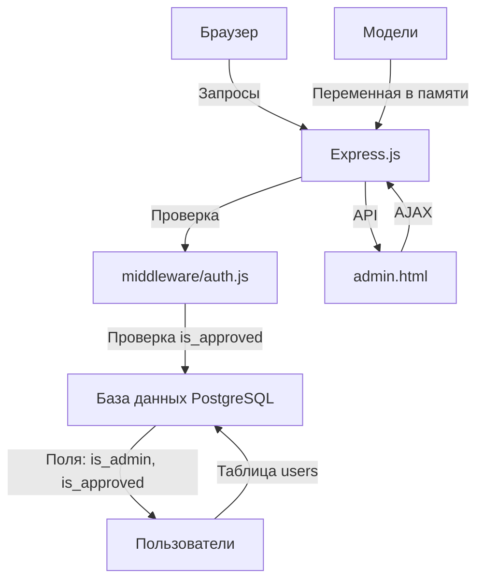

# План: Админ-панель для пользователя admin

## Цель
Создать админ-панель для пользователя `admin` с возможностью:
- Редактировать данные пользователей из БД
- Одобрять пользователей (без одобрения доступ к API недоступен)
- Удалять пользователей из БД
- Добавлять/удалять модели, доступные для пользователей

## Архитектура



## Этапы реализации

### 1. Миграция базы данных
Создать файл `migrations/003_add_admin_fields.sql`:
- Добавить поле `is_admin BOOLEAN DEFAULT false` в таблицу users
- Добавить поле `is_approved BOOLEAN DEFAULT false` в таблицу users

### 2. Обновление admin пользователя
- Обновить существующего пользователя admin, установив `is_admin = true` и `is_approved = true`

### 3. Модификация middleware/auth.js
- Добавить функцию `requireAdmin` для проверки is_admin
- Модифицировать `requireAuth` для проверки is_approved
- Добавить проверку: если пользователь не одобрен, возвращать ошибку

### 4. API endpoints для пользователей
Добавить в index.js:
- `GET /api/admin/users` - получить всех пользователей (requireAdmin)
- `PUT /api/admin/users/:id` - редактировать пользователя (requireAdmin)
- `PUT /api/admin/users/:id/approve` - одобрить пользователя (requireAdmin)
- `DELETE /api/admin/users/:id` - удалить пользователя (requireAdmin)

### 5. API endpoints для моделей
Добавить в index.js:
- `GET /api/admin/models` - получить все модели (requireAdmin)
- `POST /api/admin/models` - добавить модель (requireAdmin)
- `DELETE /api/admin/models/:id` - удалить модель (requireAdmin)

### 6. Создание админ-панели
Создать файл `public/admin.html`:
- Таблица пользователей с кнопками редактирования, одобрения и удаления
- Секция управления моделями с возможностью добавления/удаления
- Стилизация в соответствии с существующим дизайном

### 7. Маршрутизация
- Добавить статический файл admin.html в index.js
- Защитить маршрут /admin.html requireAdmin

## Детали реализации

### Проверка одобрения в middleware
```javascript
// В requireAuth добавить проверку:
const userResult = await pool.query(
  'SELECT is_approved FROM users WHERE id = $1',
  [req.session.userId]
);
if (!userResult.rows[0]?.is_approved) {
  return res.status(403).json({ error: 'user_not_approved', message: 'Ваш аккаунт ожидает одобрения администратора' });
}
```

### Хранение моделей
Модели хранятся в переменной `AVAILABLE_MODELS` в памяти (не в БД). При перезапуске сервера изменения теряются.

### Безопасность
- Все admin endpoints защищены requireAdmin
- Удаление пользователя также удаляет его проекты и сообщения (CASCADE)
- Нельзя удалить самого себя (admin не может удалить себя)

## Файлы для изменения
1. `migrations/003_add_admin_fields.sql` - создать
2. `middleware/auth.js` - изменить
3. `index.js` - изменить
4. `public/admin.html` - создать