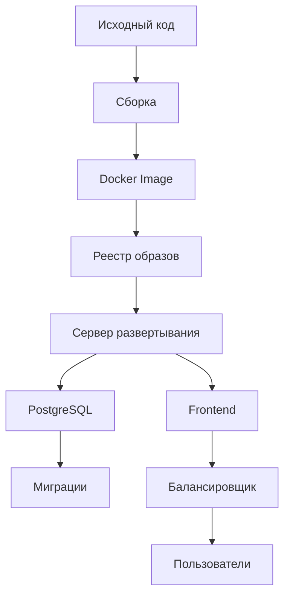

# Стратегия развертывания AI-ассистента

## Обзор проекта

**Тип проекта:** Node.js backend + PostgreSQL + Frontend SPA
**Текущая версия:** 1.0.0
**Основные компоненты:**
- Express.js сервер (index.js)
- PostgreSQL база данных
- Frontend (public/)
- Миграции (migrations/)
- Middleware (middleware/)

## Цели развертывания

1. **Автоматическая сборка** - скрипты для сборки проекта
2. **Контейнеризация** - Docker для изоляции окружения
3. **Управление конфигурацией** - переменные окружения
4. **Система обновлений** - автоматическое обновление
5. **Установка на сервер** - инсталлятор и скрипты
6. **Мониторинг** - логи и диагностика

## Архитектура развертывания



## Этапы развертывания

### 1. Подготовка окружения
- Установка Node.js 16+
- Установка Docker
- Установка PostgreSQL 12+
- Настройка переменных окружения

### 2. Сборка проекта
- Установка зависимостей
- Компиляция frontend
- Создание Docker образа
- Тестирование сборки

### 3. Настройка базы данных
- Создание базы данных
- Применение миграций
- Настройка пользователей
- Создание backup стратегии

### 4. Конфигурация сервера
- Настройка Nginx/Apache
- Настройка SSL сертификатов
- Настройка firewall
- Настройка мониторинга

### 5. Установка и запуск
- Клонирование репозитория
- Запуск Docker контейнеров
- Применение миграций
- Тестирование работоспособности

## Скрипты сборки

### package.json scripts
```json
{
  "scripts": {
    "build": "node scripts/build.js",
    "test": "node scripts/test.js",
    "deploy": "node scripts/deploy.js",
    "migrate": "node scripts/migrate.js",
    "backup": "node scripts/backup.js",
    "update": "node scripts/update.js"
  }
}
```

### Скрипты сборки
- `scripts/build.js` - сборка проекта
- `scripts/test.js` - тестирование
- `scripts/deploy.js` - развертывание
- `scripts/migrate.js` - миграции БД
- `scripts/backup.js` - backup
- `scripts/update.js` - обновление

## Docker конфигурация

### Dockerfile
```dockerfile
FROM node:18-alpine
WORKDIR /app
COPY package*.json ./
RUN npm ci --only=production
COPY . .
EXPOSE 3000
CMD ["node", "index.js"]
```

### docker-compose.yml
```yaml
version: '3.8'

services:
  app:
    build: .
    ports:
      - "3000:3000"
    environment:
      - NODE_ENV=production
      - DATABASE_URL=postgresql://user:pass@db:5432/dbname
    depends_on:
      - db
    restart: unless-stopped

  db:
    image: postgres:15-alpine
    environment:
      - POSTGRES_DB=ai_assistant
      - POSTGRES_USER=ai_user
      - POSTGRES_PASSWORD=secure_password
    volumes:
      - postgres_data:/var/lib/postgresql/data
    restart: unless-stopped

volumes:
  postgres_data:
```

## Система обновлений

### Версионирование
- **Semantic Versioning** (MAJOR.MINOR.PATCH)
- **Git tags** для релизов
- **CHANGELOG.md** для истории изменений

### Автоматическое обновление
```javascript
// scripts/update.js
const { execSync } = require('child_process');

async function update() {
  try {
    // Pull latest changes
    execSync('git pull origin main');
    
    // Install dependencies
    execSync('npm ci --only=production');
    
    // Run migrations
    execSync('npm run migrate');
    
    // Restart service
    execSync('docker-compose restart app');
    
    console.log('Update completed successfully');
  } catch (error) {
    console.error('Update failed:', error.message);
  }
}

module.exports = update;
```

### Ручное обновление
```bash
# Получение обновлений
git pull origin main

# Установка зависимостей
npm ci --only=production

# Миграция базы данных
npm run migrate

# Перезапуск сервиса
docker-compose restart app
```

## Инсталлятор

### Установочный скрипт
```bash
#!/bin/bash

# AI Assistant Installer

echo "AI Assistant Installer"
echo "====================="

# Check requirements
if ! command -v node &> /dev/null; then
    echo "Node.js is required"
    exit 1
fi

if ! command -v docker &> /dev/null; then
    echo "Docker is required"
    exit 1
fi

# Clone repository
git clone https://github.com/your-repo/ai-assistant.git
cd ai-assistant

# Install dependencies
npm ci --only=production

# Setup database
createdb ai_assistant
npm run migrate

# Setup environment
cp .env.example .env
nano .env  # Edit configuration

# Start service
docker-compose up -d

echo "Installation completed!"
echo "Access at: http://localhost:3000"
```

## Мониторинг и логи

### Health check endpoint
```javascript
// Добавить в index.js
app.get('/health', (req, res) => {
  res.json({
    status: 'ok',
    timestamp: new Date().toISOString(),
    uptime: process.uptime()
  });
});
```

### Логирование
```javascript
// Добавить в index.js
const fs = require('fs');
const logStream = fs.createWriteStream('logs/app.log', { flags: 'a' });

app.use((req, res, next) => {
  const logEntry = `${new Date().toISOString()} ${req.method} ${req.url} ${res.statusCode}\n`;
  logStream.write(logEntry);
  next();
});
```

## Backup стратегия

### Автоматический backup
```javascript
// scripts/backup.js
const { execSync } = require('child_process');
const fs = require('fs');
const path = require('path');

async function backup() {
  const backupDir = 'backups';
  const timestamp = new Date().toISOString().replace(/[:.]/g, '-');
  const backupFile = `backup-${timestamp}.sql`;
  
  // Create backup directory
  if (!fs.existsSync(backupDir)) {
    fs.mkdirSync(backupDir);
  }
  
  // Create database backup
  execSync(`pg_dump -U ai_user -d ai_assistant > ${backupDir}/${backupFile}`);
  
  console.log(`Backup created: ${backupFile}`);
}

module.exports = backup;
```

## Безопасность

### Security headers
```javascript
// Добавить в index.js
app.use((req, res, next) => {
  res.setHeader('X-Frame-Options', 'DENY');
  res.setHeader('X-Content-Type-Options', 'nosniff');
  res.setHeader('X-XSS-Protection', '1; mode=block');
  next();
});
```

### Rate limiting
```javascript
const rateLimit = require('express-rate-limit');

const limiter = rateLimit({
  windowMs: 15 * 60 * 1000, // 15 minutes
  max: 100 // limit each IP to 100 requests per windowMs
});

app.use(limiter);
```

## Документация

### Развертывание
1. Клонировать репозиторий
2. Установить зависимости
3. Настроить базу данных
4. Настроить переменные окружения
5. Запустить Docker контейнеры

### Обновление
1. Получить обновления
2. Установить зависимости
3. Применить миграции
4. Перезапустить сервис

### Backup/Restore
1. Создать backup
2. Хранить backup в безопасном месте
3. Восстановить при необходимости

## План реализации

### Этап 1: Подготовка (1-2 дня)
- [ ] Создать скрипты сборки
- [ ] Настроить Docker
- [ ] Подготовить документацию

### Этап 2: Тестирование (1 день)
- [ ] Тестировать сборку
- [ ] Тестировать развертывание
- [ ] Тестировать обновления

### Этап 3: Документация (0.5 дня)
- [ ] Написать инструкции
- [ ] Создать README
- [ ] Подготовить FAQ

### Этап 4: Релиз (0.5 дня)
- [ ] Создать релиз
- [ ] Обновить версию
- [ ] Проверить работоспособность