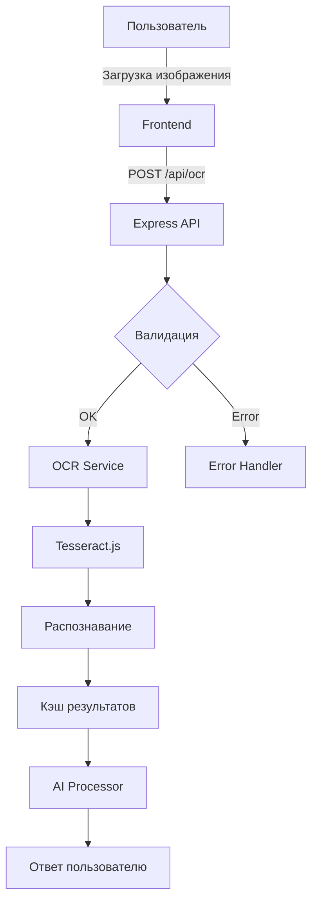
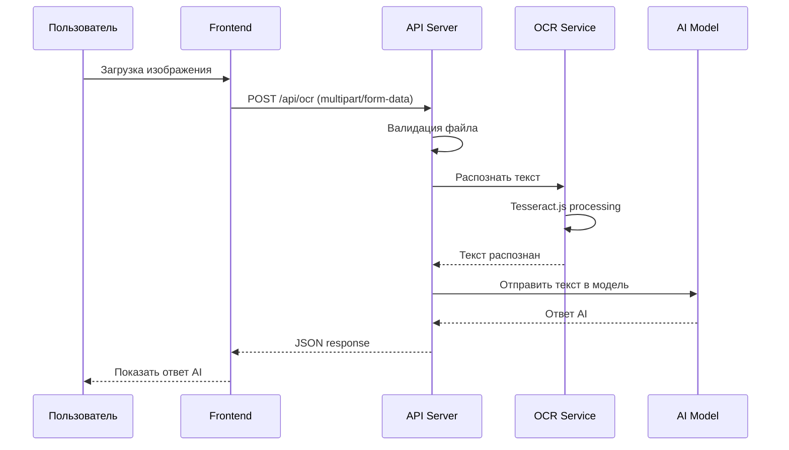

# OCR Функционал для AI Assistant

## 📋 Обзор

Добавление возможности распознавания текста с изображений (OCR) для AI-ассистента. Пользователи смогут загружать скриншоты, фото документов или любые изображения, и система будет автоматически извлекать текст и отправлять его в AI для обработки.

**UX паттерн:** Автоматическая отправка в AI после распознавания (как в GPT-4o)

---

## 🎯 Цели

1. **Поддержка загрузки изображений** — JPEG, PNG, WebP до 10MB
2. **Распознавание текста** — русский + английский языки
3. **Автоматическая отправка в AI** — распознанный текст сразу отправляется в модель
4. **Кэширование** — избегание повторного распознавания одинаковых файлов
5. **Обработка ошибок** — graceful degradation при неудачном распознавании

---

## 🏗 Архитектура

### Компоненты системы



### Поток данных



---

## 📦 Выбор OCR-библиотеки

### Tesseract.js (Рекомендуется)

**Преимущества:**
- Работает полностью на сервере Node.js
- Open-source, бесплатная
- Поддержка 100+ языков (включая ru + en)
- Не требует внешних API ключей
- Работает офлайн

**Недостатки:**
- Требует больше ресурсов CPU
- Меньшая точность для сложных документов
- Задержка 2-5 секунд на обработку

**Установка:**
```bash
npm install tesseract.js
```

---

## 🔧 Реализация

### 1. Backend API Endpoint

**Файл:** `index.js`

```javascript
// Новый endpoint для OCR с автоматической отправкой в AI
app.post('/api/ocr', requireAuth, upload.single('image'), async (req, res) => {
  try {
    if (!req.file) {
      return res.status(400).json({ error: 'Изображение не загружено' });
    }

    // Валидация типа файла
    const validTypes = ['image/jpeg', 'image/png', 'image/webp'];
    if (!validTypes.includes(req.file.mimetype)) {
      return res.status(400).json({ error: 'Неподдерживаемый формат файла' });
    }

    // Распознавание текста
    const ocrService = require('./services/ocr');
    const recognizedText = await ocrService.recognize(req.file.path);

    // Очистка временного файла
    fs.unlinkSync(req.file.path);

    // Получение ID проекта из запроса или сессии
    const projectId = req.body.projectId || req.session.projectId;

    // Отправка распознанного текста в AI
    const aiResponse = await processAiRequest({
      text: recognizedText,
      projectId: projectId,
      userId: req.user.id
    });

    res.json({ 
      success: true, 
      recognizedText: recognizedText,
      aiResponse: aiResponse,
      filename: req.file.originalname 
    });
  } catch (error) {
    console.error('OCR Error:', error);
    
    // Очистка файла в случае ошибки
    if (req.file && fs.existsSync(req.file.path)) {
      fs.unlinkSync(req.file.path);
    }
    
    res.status(500).json({ error: 'Ошибка распознавания текста' });
  }
});

// Вспомогательная функция для обработки AI запроса
async function processAiRequest({ text, projectId, userId }) {
  try {
    // Получение проекта и system prompt
    const project = await pool.query(
      'SELECT * FROM projects WHERE id = $1',
      [projectId]
    );
    
    const systemPrompt = project.rows[0]?.systemPrompt || '';
    const model = project.rows[0]?.model || 'default';

    // Формирование контекста
    const messages = [];
    
    if (systemPrompt) {
      messages.push({ role: 'system', content: systemPrompt });
    }

    // История сообщений проекта
    const history = await pool.query(
      'SELECT content, role FROM messages WHERE project_id = $1 ORDER BY created_at DESC LIMIT 10',
      [projectId]
    );

    // Добавляем последние сообщения в обратном порядке
    history.rows.forEach(msg => {
      messages.push({ role: msg.role, content: msg.content });
    });

    // Добавляем распознанный текст
    messages.push({ role: 'user', content: text });

    // Вызов OpenRouter API
    const response = await openrouter.chat({
      model: model,
      messages: messages
    });

    // Сохранение в БД
    await pool.query(
      `INSERT INTO messages (project_id, user_id, role, content) 
       VALUES ($1, $2, $3, $4)`,
      [projectId, userId, 'user', text]
    );

    await pool.query(
      `INSERT INTO messages (project_id, user_id, role, content) 
       VALUES ($1, $2, $3, $4)`,
      [projectId, userId, 'assistant', response.choices[0].message.content]
    );

    return response.choices[0].message.content;
  } catch (error) {
    console.error('AI Processing Error:', error);
    throw new Error('Не удалось обработать запрос в AI');
  }
}
```

### 2. OCR Service Module

**Файл:** `services/ocr.js`

```javascript
const Tesseract = require('tesseract.js');
const fs = require('fs');
const path = require('path');
const crypto = require('crypto');

// Кэш результатов (в памяти)
const cache = new Map();
const CACHE_TTL = 24 * 60 * 60 * 1000; // 24 часа

/**
 * Вычисляет хеш изображения для кэширования
 */
function calculateHash(filePath) {
  const content = fs.readFileSync(filePath);
  return crypto.createHash('md5').update(content).digest('hex');
}

/**
 * Очищает устаревшие записи из кэша
 */
function cleanupCache() {
  const now = Date.now();
  for (const [key, value] of cache.entries()) {
    if (now - value.timestamp > CACHE_TTL) {
      cache.delete(key);
    }
  }
}

// Запуск очистки каждые 1 час
setInterval(cleanupCache, 60 * 60 * 1000);

/**
 * Распознаёт текст с изображения
 * @param {string} imagePath - Путь к изображению
 * @param {string[]} languages - Языки для распознавания ['rus', 'eng']
 * @returns {Promise<string>} Распознанный текст
 */
async function recognize(imagePath, languages = ['rus', 'eng']) {
  try {
    const hash = calculateHash(imagePath);
    
    // Проверка кэша
    if (cache.has(hash)) {
      const cached = cache.get(hash);
      console.log('OCR: Использование кэша для', hash);
      return cached.text;
    }

    console.log('OCR: Начало распознавания', imagePath);
    
    // Распознавание с Tesseract
    const { data: { text } } = await Tesseract.recognize(
      imagePath,
      languages,
      {
        logger: m => {
          if (m.status === 'recognizing text') {
            console.log(`OCR: ${Math.round(m.progress * 100)}% завершено`);
          }
        }
      }
    );

    // Сохранение в кэш
    cache.set(hash, {
      text: text.trim(),
      timestamp: Date.now()
    });

    console.log('OCR: Распознавание завершено, длина текста:', text.length);
    return text.trim();
  } catch (error) {
    console.error('OCR Error:', error);
    throw new Error('Не удалось распознать текст: ' + error.message);
  }
}

/**
 * Получает статистику кэша
 */
function getCacheStats() {
  return {
    size: cache.size,
    entries: Array.from(cache.entries()).map(([key, value]) => ({
      hash: key,
      timestamp: value.timestamp,
      textLength: value.text.length
    }))
  };
}

module.exports = {
  recognize,
  getCacheStats,
  cleanupCache
};
```

### 3. Frontend Component

**Файл:** `public/app.js`

```javascript
// Обработка загрузки изображения
async function handleImageUpload(file) {
  const formData = new FormData();
  formData.append('image', file);
  formData.append('projectId', activeProjectId);

  try {
    // Показываем индикатор загрузки
    showLoading('Распознавание изображения...');

    const response = await fetch('/api/ocr', {
      method: 'POST',
      headers: {
        'Authorization': `Bearer ${getToken()}`
      },
      body: formData
    });

    if (!response.ok) {
      const error = await response.json();
      throw new Error(error.error || 'Ошибка распознавания');
    }

    const result = await response.json();

    // Показываем ответ AI напрямую
    addMessage({
      role: 'assistant',
      content: result.aiResponse,
      metadata: {
        source: 'ocr',
        filename: result.filename,
        recognizedText: result.recognizedText
      }
    });

    // Очищаем input
    document.getElementById('image-upload').value = '';

  } catch (error) {
    console.error('OCR Error:', error);
    showError('Не удалось распознать изображение. Попробуйте другое качество.');
  } finally {
    hideLoading();
  }
}

// Обработчик для input type="file"
document.getElementById('image-upload').addEventListener('change', (e) => {
  const file = e.target.files[0];
  if (file && file.type.startsWith('image/')) {
    handleImageUpload(file);
  }
});

// Функция показа сообщения с метаданными
function addMessage(message) {
  const messagesContainer = document.getElementById('messages');
  const messageElement = document.createElement('div');
  messageElement.className = `message message-${message.role}`;
  
  let content = message.content;
  
  // Если есть метаданные OCR, показываем информацию
  if (message.metadata?.source === 'ocr') {
    content = `*[Распознано из изображения "${message.metadata.filename}"]*\n\n${message.content}`;
  }
  
  messageElement.innerHTML = formatMessageContent(content);
  messagesContainer.appendChild(messageElement);
  
  // Автоскролл вниз
  messagesContainer.scrollTop = messagesContainer.scrollHeight;
}
```

**Файл:** `public/index.html` (добавить в UI)

```html
<!-- Кнопка загрузки изображения в области ввода -->
<div class="input-controls">
  <label for="image-upload" class="btn btn-icon" title="Загрузить изображение">
    📷
  </label>
  <input 
    type="file" 
    id="image-upload" 
    accept="image/jpeg,image/png,image/webp" 
    style="display: none"
  >
  
  <input 
    type="text" 
    id="message-input" 
    placeholder="Введите сообщение..." 
    autocomplete="off"
  >
  
  <button id="send-btn" class="btn btn-primary">
    Отправить
  </button>
</div>

<!-- Индикатор прогресса -->
<div id="loading-indicator" class="loading-indicator" style="display: none;">
  <div class="spinner"></div>
  <span class="loading-text">Распознавание изображения...</span>
</div>
```

**Файл:** `public/styles.css` (добавить стили)

```css
/* Кнопка загрузки изображения */
.btn-icon {
  background: none;
  border: none;
  font-size: 1.5rem;
  cursor: pointer;
  padding: 0.5rem;
  border-radius: 4px;
  transition: background-color 0.2s;
}

.btn-icon:hover {
  background-color: #f0f0f0;
}

/* Индикатор загрузки */
.loading-indicator {
  display: flex;
  align-items: center;
  gap: 0.5rem;
  padding: 1rem;
  background-color: #f5f5f5;
  border-radius: 8px;
  margin: 1rem 0;
}

.spinner {
  width: 20px;
  height: 20px;
  border: 2px solid #f3f3f3;
  border-top: 2px solid #3498db;
  border-radius: 50%;
  animation: spin 1s linear infinite;
}

@keyframes spin {
  0% { transform: rotate(0deg); }
  100% { transform: rotate(360deg); }
}

.loading-text {
  color: #666;
  font-size: 0.9rem;
}

/* Сообщение с метаданными OCR */
.message-ocr {
  border-left: 3px solid #3498db;
  padding-left: 1rem;
}

.message-ocr .metadata {
  font-size: 0.8rem;
  color: #888;
  margin-bottom: 0.5rem;
}
```

---

## 🔒 Безопасность

### Валидация файлов

```javascript
// Проверка MIME типа
const validMimes = ['image/jpeg', 'image/png', 'image/webp'];
if (!validMimes.includes(file.mimetype)) {
  return res.status(400).json({ error: 'Invalid file type' });
}

// Проверка размера (10MB limit)
if (file.size > 10 * 1024 * 1024) {
  return res.status(400).json({ error: 'File too large' });
}

// Проверка заголовка файла (magic bytes)
const magicBytes = {
  'jpeg': [0xFF, 0xD8, 0xFF],
  'png': [0x89, 0x50, 0x4E, 0x47],
  'webp': [0x52, 0x49, 0x46, 0x46]
};
```

### Защита от злоупотреблений

- Лимит: 10 изображений в час на пользователя
- Очередь обработки (чтобы не перегружать CPU)
- Мониторинг использования памяти

---

## 📊 Производительность

### Оптимизации

1. **Кэширование** — одинаковые изображения не распознаются повторно
2. **Асинхронная обработка** — не блокирует основной поток
3. **Очередь задач** — обработка по очереди при высокой нагрузке
4. **Сжатие изображений** — предварительное уменьшение размера перед OCR

### Рекомендации по ресурсам

- Минимум: 2 CPU ядра, 4GB RAM
- Для высокой нагрузки: использовать Redis для очереди
- Для production: рассмотреть GPU для ускорения

---

## 🧪 Тестирование

### Unit-тесты

```javascript
// tests/ocr.test.js
const { recognize } = require('../services/ocr');

test('recognizes text from image', async () => {
  const result = await recognize('./test-images/sample.jpg');
  expect(result).toContain('тест');
  expect(typeof result).toBe('string');
});

test('caches results', async () => {
  const result1 = await recognize('./test-images/sample.jpg');
  const result2 = await recognize('./test-images/sample.jpg');
  expect(result1).toBe(result2);
});
```

### Integration-тесты

```javascript
// tests/ocr-api.test.js
test('POST /api/ocr returns recognized text and AI response', async () => {
  const response = await request(app)
    .post('/api/ocr')
    .set('Authorization', `Bearer ${testToken}`)
    .attach('image', './test-images/sample.jpg');
  
  expect(response.status).toBe(200);
  expect(response.body.success).toBe(true);
  expect(response.body.recognizedText).toBeDefined();
  expect(response.body.aiResponse).toBeDefined();
});
```

---

## 📝 Документация для пользователей

### Как использовать

1. Нажмите кнопку **"📷"** в поле ввода сообщения
2. Выберите изображение (JPEG, PNG, WebP до 10MB)
3. Система автоматически распознает текст
4. Распознанный текст отправляется AI для обработки
5. Получите ответ от ассистента

### Поддерживаемые форматы

- ✅ JPEG / JPG
- ✅ PNG
- ✅ WebP

### Ограничения

- Максимальный размер: 10MB
- Время обработки: 2-5 секунд
- Языки: русский, английский (можно добавить другие)

### Советы для лучшего результата

- Используйте изображения с высоким контрастом
- Избегайте размытых или тёмных фото
- Для документов держите камеру перпендикулярно
- Убедитесь, что текст хорошо читается

---

## 🚀 План внедрения

### Этап 1: Подготовка (1 день)
- [ ] Установить Tesseract.js
- [ ] Создать структуру папок `services/ocr.js`
- [ ] Настроить базовую конфигурацию

### Этап 2: Backend (1 день)
- [ ] Создать API endpoint `/api/ocr`
- [ ] Реализовать OCR service
- [ ] Добавить интеграцию с AI processor
- [ ] Добавить валидацию файлов
- [ ] Настроить кэширование

### Этап 3: Frontend (0.5 дня)
- [ ] Добавить кнопку загрузки изображения
- [ ] Реализовать обработчик отправки
- [ ] Добавить индикаторы прогресса
- [ ] Обработать ошибки
- [ ] Добавить стили для OCR сообщений

### Этап 4: Тестирование (0.5 дня)
- [ ] Написать unit-тесты
- [ ] Протестировать с разными изображениями
- [ ] Проверить обработку ошибок
- [ ] Оптимизировать производительность

### Этап 5: Документация (0.25 дня)
- [ ] Написать инструкцию для пользователей
- [ ] Добавить комментарии в код
- [ ] Обновить README

---

## 📈 Будущие улучшения

1. **Поддержка других языков** — добавить 10+ языков
2. **Предварительная обработка** — улучшение качества изображений
3. **Распознавание таблиц** — структурирование данных
4. **OCR в фоновом режиме** — асинхронные уведомления
5. **Интеграция с Google Vision** — для сложных документов
6. **Batch-обработка** — распознавание нескольких изображений сразу

---

## 📚 Ресурсы

- [Tesseract.js Documentation](https://tesseract.projectnaptha.com/)
- [Multer Documentation](https://expressjs.com/en/resources/middleware/multer.html)
- [OpenCV.js](https://opencv.org/javascript/) — для предобработки изображений

---

**Автор:** AI Assistant Development Team  
**Версия:** 1.0  
**Дата:** 2026-03-18
