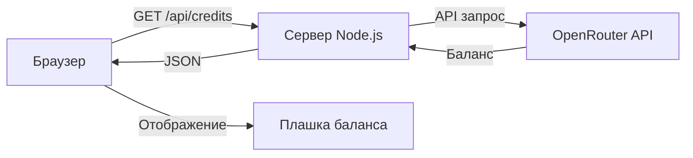

# План: Отображение баланса OpenRouter в чате

## Цель
Добавить в интерфейс чата отображение общего баланса аккаунта OpenRouter и потраченных средств в нижнем правом углу.

## Архитектура



## Реализация

### 1. Серверная часть (index.js)

Добавить новый API-эндпоинт:

```javascript
// GET /api/credits
// Возвращает: { balance: "10.00", spent: "0.50", currency: "USD" }
app.get('/api/credits', async (req, res) => {
  try {
    const response = await fetch('https://openrouter.ai/api/v1/credits', {
      headers: {
        'Authorization': `Bearer ${process.env.OPENROUTER_API_KEY}`,
        'Content-Type': 'application/json'
      }
    });
    const data = await response.json();
    // Обработка ответа и возврат баланса
  } catch (error) {
    res.status(500).json({ error: error.message });
  }
});
```

### 2. Клиентская часть (public/index.html)

Добавить HTML элемент в контейнер:

```html
<div id="credits-panel" class="credits-panel">
  <div class="credits-item">
    <span class="credits-label">Баланс:</span>
    <span id="balance-amount" class="credits-value">--</span>
  </div>
  <div class="credits-item">
    <span class="credits-label">Потрачено:</span>
    <span id="spent-amount" class="credits-value">--</span>
  </div>
</div>
```

Добавить CSS стили:

```css
.credits-panel {
  position: fixed;
  bottom: 20px;
  right: 20px;
  background: var(--panel);
  border: 1px solid var(--border);
  border-radius: 12px;
  padding: 12px 16px;
  font-size: 13px;
  box-shadow: var(--shadow);
  z-index: 100;
}

.credits-item {
  display: flex;
  justify-content: space-between;
  gap: 16px;
}

.credits-item + .credits-item {
  margin-top: 6px;
}

.credits-label {
  color: var(--muted);
}

.credits-value {
  color: var(--accent);
  font-weight: 600;
}
```

### 3. JavaScript логика (public/app.js)

Добавить функцию получения баланса:

```javascript
async function loadCredits() {
  try {
    const response = await fetch('/api/credits');
    const data = await response.json();
    
    document.getElementById('balance-amount').textContent = 
      data.balance ? `$${data.balance}` : '--';
    document.getElementById('spent-amount').textContent = 
      data.spent ? `$${data.spent}` : '--';
  } catch (error) {
    console.error('Ошибка загрузки баланса:', error);
  }
}

// Загружать при старте и обновлять каждые 60 секунд
loadCredits();
setInterval(loadCredits, 60000);
```

## Файлы для изменения

| Файл | Изменения |
|------|-----------|
| `index.js` | Добавить эндпоинт `/api/credits` |
| `public/index.html` | Добавить HTML плашки и CSS стили |
| `public/app.js` | Добавить загрузку и обновление баланса |

## Альтернативный вариант

Если OpenRouter API не предоставляет историю трат, можно:
1. Накапливать данные о тратах локально в базе данных
2. Суммировать `cost` из каждого ответа API и хранить в БД
3. Показывать накопленную сумму как "Потрачено"

## Результат

После реализации в правом нижнем углу чата появится плашка:
```
Баланс:    $10.00
Потрачено: $0.50
```

Данные будут обновляться автоматически каждые 60 секунд.